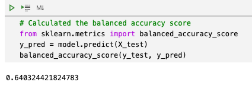
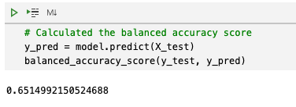
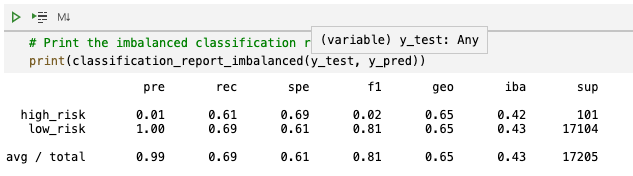
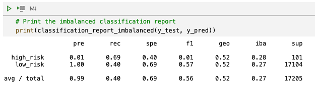
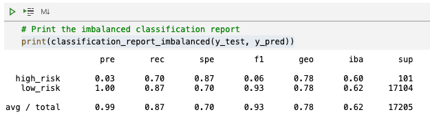
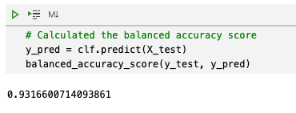

# Credit Risk Analysis

## Overview
### Credit risk is an inherently unbalanced classification problem, as good loans easily outnumber risky loans. 
Using the credit card credit dataset from LendingClub, a peer-to-peer lending services company, 6 different machine learning models were applied to the dataset to determine which is the best machine learning model to predict credit risk.

## Results
### Using resampling, the imbalanced-learn and scikit-learn libraries were used to build and evaluate the following six machine learning models:

1. Oversample with RandomOverSampler algorithm
    * Balanced accuracy score: 64
    * Precision score (avg): .99
    * Recall score (avg): .62

2.  Oversample with SMOTE algorithm
    * Balanced accuracy score: 65
    * Precision score (avg): .99
    * Recall score (avg): .69

3. Undersample with ClusterCentroids algorithm
    * Balanced accuracy score: 55
    * Precision score (avg): .99
    * Recall score (avg): .40

4. Over and undersampling with SMOTEENN algorithm
    * Balanced accuracy score: 65
    * Precision score (avg): .99
    * Recall score (avg): .69

5. Reduce bias with BalancedRandomForestClassifier
    * Balanced accuracy score: .79
    * Precision score (avg): .99
    * Recall score (avg): .87 

6. Reduce bias with EasyEnsembleClassifier
    * Balanced accuracy score: .93
    * Precision score (avg): .99
    * Recall score (avg): .94

## Summary
With a balanced accuracy of .93, the EasyEnsembleClassifier machine learning is the clear winner in terms of the best accuracy. Each model had a percision score of .99. The sensitivity of correctly predicted outcomes, or the recall score, ranking from high to low is as follows: EasyEnsembleClassifier, BalancedRandomForestClassifier, SMOTEENN, SMOTE, RandomOverSampler, ClusterCentroids. Based on this reporting to predict credit risk, I recommend the EasyEnsembleClassifier machine learning for the balanced accuracy score, precision score and recall score.