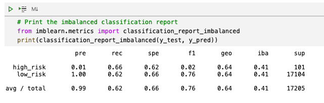
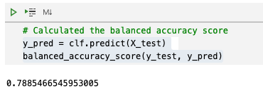

# Credit Risk Analysis

## Overview
### Credit risk is an inherently unbalanced classification problem, as good loans easily outnumber risky loans. 
Using the credit card credit dataset from LendingClub, a peer-to-peer lending services company, 6 different machine learning models were applied to the dataset to determine which is the best machine learning model to predict credit risk.

## Results
### Using resampling, the imbalanced-learn and scikit-learn libraries were used to build and evaluate the following six machine learning models:

* Oversample with RandomOverSampler algorithm
    * Balanced accuracy score:
    * Precision score:
    * Recall scorce:

* Oversample with SMOTE algorithm
    * Balanced accuracy score:
    * Precision score:
    * Recall scorce:

* Undersample with ClusterCentroids algorithm
    * Balanced accuracy score:
    * Precision score:
    * Recall scorce:

* Over and undersampling with SMOTEENN algorithm
    * Balanced accuracy score:
    * Precision score:
    * Recall scorce:

* Reduce bias with BalancedRandomForestClassifier
    * Balanced accuracy score:
    * Precision score:
    * Recall scorce:

* Reduce bias with EasyEnsembleClassifier
    * Balanced accuracy score:
    * Precision score:
    * Recall scorce:

## Summary

Summarize the results of the machine learning models, and include a recommendation on the model to use, if any. If you do not recommend any of the models, justify your reasoning. 

